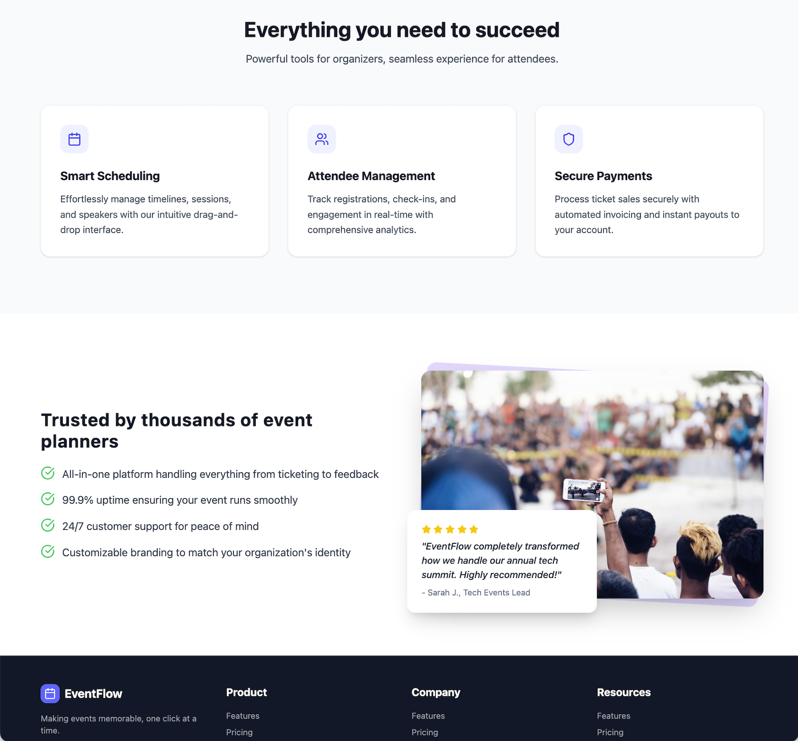
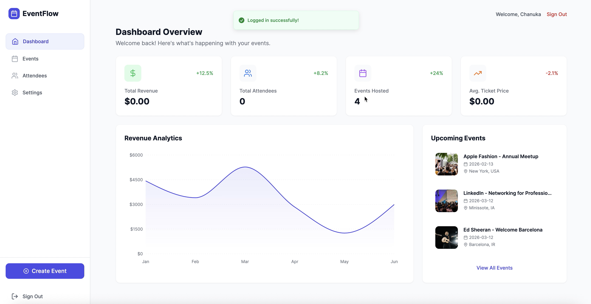
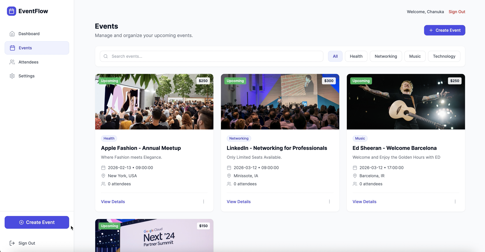

# Event Management System

[](https://opensource.org/licenses/MIT)
[](https://spring.io/projects/spring-boot)
[](https://reactjs.org/)
[](https://www.oracle.com/java/)
[](https://www.typescriptlang.org/)
[](https://www.docker.com/)

A microservices-based event management platform built with **Spring Boot**, **React**, and **Vite**.

---

## Application Preview 


<br>

<br>

🧑‍💼 Organizer Dashboard

 <br><br>  <br><br>
<br>

🎟️ Attendee Dashboard


## 🎯 Overview

EventFlow is a comprehensive event management system featuring microservices architecture, JWT authentication, role-based access control, and a modern React frontend. The platform supports event organizers and attendees with complete event lifecycle management.

**Key Highlights:**
- ✅ Fully implemented JWT authentication & authorization
- ✅ 8 microservices with service discovery
- ✅ Role-based access (Admin, Organizer, Attendee)
- ✅ Real-time analytics and dashboard
- ✅ Complete booking and ticketing system
- ✅ User profile management with preferences
- ✅ Docker-ready production deployment

---

## 🚀 Quick Start

### Using Docker (Recommended)

```bash
git clone https://github.com/HasithFernando/event-management-system.git
cd event-management-system
docker-compose up --build
```

**Access the application:**
- 🌐 Frontend: http://localhost:3000
- 🔍 Eureka Dashboard: http://localhost:8761
- 🌉 API Gateway: http://localhost:8080


### Local Development

See [DEPLOYMENT.md](DEPLOYMENT.md) for detailed local setup instructions.

---

## 🏗️ Architecture

```
Frontend (React/Vite) → API Gateway (JWT Auth) → Microservices → H2 Databases
                              ↓
                       Eureka Discovery
```

### Microservices

| Service | Port | Description |
|---------|------|-------------|
| **Frontend** | 3000 | React + Vite application |
| **API Gateway** | 8080 | JWT authentication & routing |
| **Eureka Server** | 8761 | Service discovery |
| **Config Server** | 8888 | Centralized configuration |
| **Auth Service** | 8082 | User authentication & JWT |
| **Event Service** | 8081 | Event management |
| **Ticket Service** | 8084 | Ticket operations |
| **Notification Service** | 8085 | Event notifications |
| **Analytics Service** | 8086 | Analytics & reporting |
| **Admin Service** | 8087 | Admin operations |
| **Profile Service** | 8088 | User profile management |

### Technology Stack

**Backend:**
- Spring Boot 3.2.5, Java 17
- Spring Cloud (Gateway, Eureka, Config)
- JWT authentication (JJWT)
- H2 in-memory databases
- OpenFeign for inter-service communication

**Frontend:**
- React 18 with Vite
- TypeScript
- Tailwind CSS
- React Router
- Recharts for analytics

**DevOps:**
- Docker & Docker Compose
- Multi-stage Docker builds
- Nginx for frontend serving

---

## ✨ Features

### Authentication & Security
- ✅ JWT-based authentication
- ✅ Bcrypt password hashing
- ✅ Role-based access control (Admin, Organizer, Attendee)
- ✅ API Gateway security filtering
- ✅ Protected routes and endpoints

### User Roles

**Admin:**
- Dashboard with system-wide analytics
- User management (view, delete, ban/unban)
- Event management (all events)
- Access to all features

**Organizer:**
- Create and manage events
- View attendee lists
- Track ticket sales
- Event analytics

**Attendee:**
- Browse and search events
- Purchase tickets
- View booking history
- Event notifications

### Core Features
- 📅 Event creation and management
- 🎫 Ticket purchasing and management
- 👥 Attendee registration and tracking
- 📊 Analytics dashboard with charts
- 🔍 Event search and filtering
- 📧 Notification system
- 💳 Booking and payment tracking

---

## 📚 API Endpoints

All endpoints accessible through API Gateway at `http://localhost:8080`

### Authentication (`/api/auth`)
```
POST   /api/auth/register    # User registration
POST   /api/auth/login       # User login (returns JWT)
```

### Events (`/api/events`)
```
GET    /api/events           # List all events
POST   /api/events           # Create event (Organizer/Admin)
GET    /api/events/{id}      # Get event details
PUT    /api/events/{id}      # Update event (Organizer/Admin)
DELETE /api/events/{id}      # Delete event (Admin)
```

### Attendees (`/api/attendees`)
```
GET    /api/attendees             # List attendees
POST   /api/attendees             # Register attendee
GET    /api/attendees/{id}        # Get attendee details
PUT    /api/attendees/{id}/status # Update status
```

### Tickets (`/api/tickets`)
```
GET    /api/tickets          # List tickets
POST   /api/tickets          # Purchase ticket
GET    /api/tickets/{id}     # Get ticket details
```

### Analytics (`/api/analytics`)
```
GET    /api/analytics/overview  # System overview
GET    /api/analytics/revenue   # Revenue data
```

### Admin (`/api/admin`)
```
GET    /api/admin/dashboard/stats    # Dashboard statistics
GET    /api/admin/events             # All events
GET    /api/admin/users              # All users
DELETE /api/admin/users/{id}         # Delete user
```

**Security:** All endpoints (except `/api/auth/*`) require valid JWT token in Authorization header.

---

## 🔧 Configuration

### Frontend Environment

Create [`frontend/.env.local`](frontend/.env.local):
```env
VITE_API_URL=http://localhost:8080
```

### Backend JWT Configuration

JWT secret configured in [`backend/auth-service/src/main/resources/application.yml`](backend/auth-service/src/main/resources/application.yml):
```yaml
jwt:
  secret: <base64-encoded-secret>
  expiration: 86400000  # 24 hours
```

**Note:** Same JWT secret must be configured in [`backend/api-gateway/src/main/resources/application.yml`](backend/api-gateway/src/main/resources/application.yml).

---

## 📁 Project Structure

```
event-management-system/
├── backend/
│   ├── api-gateway/           # JWT authentication & routing
│   ├── eureka-server/         # Service discovery
│   ├── config-server/         # Configuration server
│   ├── auth-service/          # Authentication & user management
│   ├── event-service/         # Event CRUD operations
│   ├── attendee-service/      # Attendee management
│   ├── ticket-service/        # Ticket operations
│   ├── notification-service/  # Notifications
│   ├── analytics-service/     # Analytics & reporting
│   └── admin-service/         # Admin operations
├── frontend/                  # React + Vite application
├── config-repo/              # Shared configurations
├── docker-compose.yml        # Docker orchestration
├── DEPLOYMENT.md             # Deployment guide
└── README.md                 # This file
```

---

## 🛠️ Development

### Build Commands

```bash
# Build all services
./build.sh  # Linux/Mac
build.bat   # Windows

# Build individual service
cd backend/auth-service
mvn clean package -DskipTests

# Build frontend
cd frontend
npm install
npm run build
```

### Docker Commands

```bash
docker-compose up --build      # Build and start all services
docker-compose down            # Stop all services
docker-compose logs -f         # View logs
docker-compose ps              # List containers
docker-compose down -v         # Remove volumes
```

---

## 🔐 Security Notes

✅ **Implemented:**
- JWT token-based authentication
- Password hashing with BCrypt
- API Gateway security filtering
- Role-based access control
- Protected routes

⚠️ **Production Recommendations:**
- Change default admin password
- Use environment variables for secrets
- Enable HTTPS/TLS
- Implement rate limiting
- Add CORS configuration
- Set up proper logging and monitoring
- Use managed databases (not H2)

---


## 🐛 Troubleshooting

**Services not registering with Eureka:**
- Wait 30-60 seconds for registration
- Check Eureka dashboard at http://localhost:8761

**JWT token errors:**
- Verify JWT secrets match in auth-service and api-gateway
- Check token expiration time

**Port conflicts:**
- Stop conflicting services or change ports in `application.yml`

**Docker issues:**
```bash
docker-compose down -v
docker system prune -f
docker-compose up --build
```

For detailed troubleshooting, see [DEPLOYMENT.md](DEPLOYMENT.md).

---

## 📄 License

This project is licensed under the MIT License - see the [LICENSE](LICENSE) file for details.

---

## 🤝 Contributing

Contributions welcome! Please ensure:
- Code follows existing patterns
- JWT authentication is maintained
- Role-based access is respected
- Documentation is updated

---

## 📞 Support

For issues or questions:
- Check service health: `http://localhost:8080/actuator/health`
- View Eureka dashboard: `http://localhost:8761`
- Check logs: `docker-compose logs [service-name]`

**Version:** 1.0.0 | **Status:** Production Ready | **License:** MIT